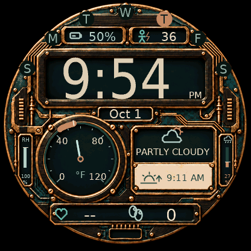

# Prismelier

A futuristic-steampunk digital watch face for the **Garmin Forerunner 265**. The default **Foundry** theme combines ebony-inspired wood grain, patinated copper, raised material relief and intricate robotics details.



*Official FR265 simulator capture of the current build, using simulated weather and health data.*

## Status

This section is the project's single status record; other documents link here.

**Selected A is implemented:** paired vertical rails show relative humidity on the left and today’s precipitation chance on the right. Body Battery is restored upper-right, separate from device battery. The new selected material, shifted dial/vitals, thick daily forecast arc and awake HR refresh are included. The current FR265 build passes native compilation and visual simulator review; physical rendering and battery-life validation remain pending.

| Check | State |
|---|---|
| FR265 compile (SDK 9.2.0, official profile) | Current revision passes |
| FR265 simulator | Current Foundry layout reviewed: icons/text, weather rails, forecast arc, 12/24-hour time, AOD/wake |
| Source, layout and asset tests | 105 pass, including SDK checks (`python -m unittest discover -s tests`) |
| CI workflow | Prepared; no runner provisioned, so no CI build yet ([CI](docs/CI.md)) |
| Physical FR265 | **Not yet tested**: fonts on AMOLED, AOD transitions, weather sync, battery drain |

Remaining validation is listed in [QA](docs/QA.md#open-validation).

## Features

- Prominent **digital time**, following the watch's 12/24-hour preference, with a compact AM/PM mark inside the time window
- **Temperature dial** with a thin 270° track, thick copper arc for today’s forecast low–high range, current-temperature needle, labeled scale and unit; no extra current/low/high numeric readings
- **Weather panel** with a monoline condition icon and condition label (`PARTLY CLOUDY`, `RAIN`, `AGED 3H`…)
- **Weekday rim** (`S M T W T F S`) with today on an inverted copper plate, plus a local month/day such as `Oct 1`
- Next **sunrise or sunset time**, with distinct event icons
- **Device battery percentage** at top left and a separate **Body Battery score** at top right; paired vertical relative-humidity (left) and daily precipitation (right) rails
- **Heart rate** checked every second while awake using Garmin’s current value, with recent history as fallback; daily **steps**
- Sparse, dim, repositioning digital-time-only **always-on display**

The target is the **416 × 416 AMOLED Forerunner 265** (`fr265`). Compatibility with the 265S or other watches is not declared.


*Reactor, Porcelain and Nocturne. A [24-hour/Celsius screenshot](docs/screenshots/foundry-24h-celsius.png) is also available.*

## Build and install

**[Download Prismelier for Forerunner 265 (.prg)](https://github.com/bensonlee5/prismelier/raw/refs/heads/main/dist/Prismelier-fr265.prg)** — ready to copy to the watch's existing `GARMIN/APPS` folder. This build is for the **265 only, not the 265S**. It uses the Foundry theme, Fahrenheit and the watch's time format. No SDK is needed to install the download; start at [USB installation](docs/INSTALL.md#4-copy-the-prg-over-usb), then select Prismelier on the watch.

The download includes the current HR/humidity/forecast revision, built with SDK 9.2.0 from `a861bb1`. It passed 105 automated checks and FR265 visual simulator review, including the corrected gauge labels inside their copper frames. Older theme screenshots show the previous release. Physical-watch rendering and battery life remain unverified. [Build details](dist/build-info.json) and [SHA-256 checksum](dist/SHA256SUMS) accompany the binary.

To build from source instead:

Follow the [build and USB installation guide](docs/INSTALL.md) for Linux, Windows or macOS:

1. Install Garmin's official Connect IQ SDK, the **Forerunner 265 device profile** and the Monkey C tools
2. Configure a private signing key, build for `fr265`, and validate in Garmin's simulator
3. Copy the resulting `.prg` to `GARMIN/APPS` over USB, disconnect safely and select Prismelier on the watch

Sideloading requires a computer. The iPhone Connect IQ app cannot import a raw development `.prg`, and there is no Garmin Store listing. Keep signing keys outside the repository.

[Compile Forerunner 265](https://github.com/bensonlee5/prismelier/actions/workflows/compile.yml) is a **manually triggered, owner-only** GitHub Actions workflow for trusted `main`, run on a dedicated, pre-provisioned Linux runner. Read the [CI setup and security guide](docs/CI.md) before registering a runner for this public repository.

For repeatable per-model packages and public GitHub releases, see the
[multi-device build guide and compatibility matrix](docs/MULTI_DEVICE.md).
All 14 configured round AMOLED profiles across 360/390/416/454px compile with SDK 9.2.0. Only FR265 has current simulator review; other models remain compile-only candidates. See the [build matrix record](docs/build-matrix-results.json).

## Settings and data

Foundry and **Fahrenheit** are the defaults. Optional settings include Celsius/device units, explicit 12/24-hour time and three procedural color palettes: Reactor, Porcelain and Nocturne. See [settings instructions](docs/INSTALL.md#preferences); phone settings for unpublished sideloaded apps are not guaranteed.

Weather uses Garmin's existing cache; sunrise/sunset uses the weather observation location, which may differ from your current position. The face cannot force a fresh weather observation. Old data is marked, and unavailable values are not replaced with demo readings. Humidity shares the weather observation’s age handling; the left rail uses a crossed track for unavailable data. Body Battery uses Garmin’s current complication on wake/change notifications, with minute reconciliation and timestamped history as fallback; Garmin supplies no fixed refresh cadence. The forecast arc appears only for today’s local-date entry with valid bounds and an accompanying weather observation under two hours old. Equal bounds show one mark, and off-scale ranges show overflow chevrons. Heart rate checks Garmin’s current value on each awake update; this does not guarantee a new physiological sample each second. A valid history sample at most two minutes old is used if current HR is unavailable; otherwise `--` is shown. See [data setup and troubleshooting](docs/INSTALL.md#6-get-weather-solar-heart-rate-and-humidity-working).

The face has no backend, API key or network permission. It does not activate GPS or transmit health data. Data is cached in RAM, and the textured background is omitted from AOD. See the [performance review](docs/PERFORMANCE.md) for CPU and memory measurements.

## Development

Run source and asset checks (Pillow and an SDK path enable optional checks; see [QA](docs/QA.md)):

```sh
python -m unittest discover -s tests -v
```

Render the selected fixture with `python tools/render_preview.py` (Node and Pillow). This executes the drawing subset with fixture data; it does not compile Monkey C or validate Garmin APIs. The selected reference/spec are in `docs/screenshots/selected-a-reference.png` and `docs/design/selected-a.json`.

With the official SDK and device profile installed:

```sh
python tools/build.py --sdk /path/to/connectiq-sdk --key /private/path/developer_key --release
```

## Credits

The Foundry texture is an AI-generated project asset; live icons and alternate-theme artwork are code-drawn. See [asset provenance and graphics budget](docs/TEXTURE.md). DejaVu font terms are included in the [font license](resources/fonts/LICENSE-DejaVu.txt).

Garmin, Forerunner and Connect IQ are trademarks of Garmin. Prismelier is an independent project and is not endorsed by Garmin.
