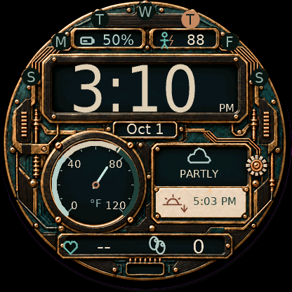
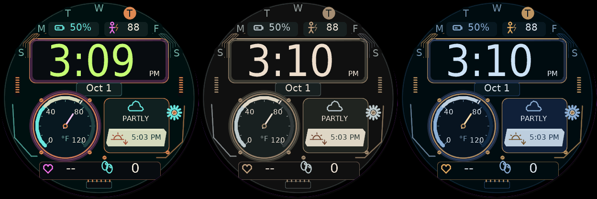

# Prismelier

A futuristic-steampunk digital watch face for the **Garmin Forerunner 265**. The default **Foundry** theme combines ebony-inspired wood grain, patinated copper, raised material relief and intricate robotics details.



*Connect IQ FR265 simulator screenshot (simulated data: no heart rate, 0 steps).*

## Status

This section is the project's single status record; other documents link here.

| Check | State |
|---|---|
| FR265 compile (SDK 9.2.0, official profile) | Passes, warnings only |
| FR265 simulator | Runs in all four themes, 12/24-hour and °F/°C; [profiled](docs/PERFORMANCE.md#simulator-profile-1-october-2026) |
| Source, layout and asset tests | Pass (`python -m unittest discover -s tests`) |
| CI workflow | Prepared; no runner provisioned, so no CI build yet ([CI](docs/CI.md)) |
| Physical FR265 | **Not yet tested**: fonts on AMOLED, AOD transitions, weather sync, battery drain |

Remaining validation is listed in [QA](docs/QA.md#open-validation).

## Features

- Prominent **digital time**, following the watch's 12/24-hour preference, with a compact AM/PM mark inside the time window
- **Temperature dial** with a 270° band, needle, labeled scale and unit; no separate numeric temperature reading
- **Weather panel** with a monoline condition icon and condition label (`PARTLY CLOUDY`, `RAIN`, `AGED 3H`…)
- **Weekday rim** (`S M T W T F S`) with today on an inverted copper plate, plus a local month/day such as `Oct 1`
- Next **sunrise or sunset time**, with distinct event icons
- **Device battery percentage** at top left and a separate **Body Battery score** at top right
- Recent **heart rate** and daily **steps**
- Sparse, dim, repositioning digital-time-only **always-on display**

The target is the **416 × 416 AMOLED Forerunner 265** (`fr265`). Compatibility with the 265S or other watches is not declared.



*Reactor, Porcelain and Nocturne. A [24-hour/Celsius screenshot](docs/screenshots/foundry-24h-celsius.png) is also available.*

## Build and install

**[Download Prismelier for Forerunner 265 (.prg)](https://github.com/bensonlee5/prismelier/raw/refs/heads/main/dist/Prismelier-fr265.prg)** — ready to copy to the watch's existing `GARMIN/APPS` folder. This build is for the **265 only, not the 265S**. It uses the Foundry theme, Fahrenheit and the watch's time format. No SDK is needed to install the download; start at [USB installation](docs/INSTALL.md#4-copy-the-prg-over-usb), then select Prismelier on the watch.

The committed release build uses SDK 9.2.0 and passed all 59 automated checks plus FR265 simulator checks for the full weather label and always-on/wake transitions. Physical-watch rendering and battery life remain unverified. [Build details](dist/build-info.json) and [SHA-256 checksum](dist/SHA256SUMS) accompany the binary.

To build from source instead:

Follow the [build and USB installation guide](docs/INSTALL.md) for Linux, Windows or macOS:

1. Install Garmin's official Connect IQ SDK, the **Forerunner 265 device profile** and the Monkey C tools
2. Configure a private signing key, build for `fr265`, and validate in Garmin's simulator
3. Copy the resulting `.prg` to `GARMIN/APPS` over USB, disconnect safely and select Prismelier on the watch

Sideloading requires a computer. The iPhone Connect IQ app cannot import a raw development `.prg`, and there is no Garmin Store listing. Keep signing keys outside the repository.

[Compile Forerunner 265](https://github.com/bensonlee5/prismelier/actions/workflows/compile.yml) is a **manually triggered, owner-only** GitHub Actions workflow for trusted `main`, run on a dedicated, pre-provisioned Linux runner. Read the [CI setup and security guide](docs/CI.md) before registering a runner for this public repository.

For repeatable per-model packages and public GitHub releases, see the
[multi-device build guide and compatibility matrix](docs/MULTI_DEVICE.md).
Additional 416px AMOLED models are build candidates, not yet verified downloads.

## Settings and data

Foundry and **Fahrenheit** are the defaults. Optional settings include Celsius/device units, explicit 12/24-hour time and three procedural color palettes: Reactor, Porcelain and Nocturne. See [settings instructions](docs/INSTALL.md#preferences); phone settings for unpublished sideloaded apps are not guaranteed.

Weather uses Garmin's existing cache; sunrise/sunset uses the weather observation location, which may differ from your current position. The face cannot force a fresh weather observation. Old data is marked, and unavailable values are not replaced with demo readings. Heart rate is a recent sample; Body Battery is a wellness estimate, not a medical measurement. See [data setup and troubleshooting](docs/INSTALL.md#6-get-weather-solar-heart-rate-and-body-battery-working).

The face has no backend, API key or network permission. It does not activate GPS or transmit health data. Data is cached in RAM, and the textured background is omitted from AOD. See the [performance review](docs/PERFORMANCE.md) for CPU and memory measurements.

## Development

Run source and asset checks (Pillow and an SDK path enable optional checks; see [QA](docs/QA.md)):

```sh
python -m unittest discover -s tests -v
```

With the official SDK and device profile installed:

```sh
python tools/build.py --sdk /path/to/connectiq-sdk --key /private/path/developer_key --release
```

## Credits

The Foundry texture is an AI-generated project asset; live icons and alternate-theme artwork are code-drawn. See [asset provenance and graphics budget](docs/TEXTURE.md). DejaVu font terms are included in the [font license](resources/fonts/LICENSE-DejaVu.txt).

Garmin, Forerunner and Connect IQ are trademarks of Garmin. Prismelier is an independent project and is not endorsed by Garmin.
