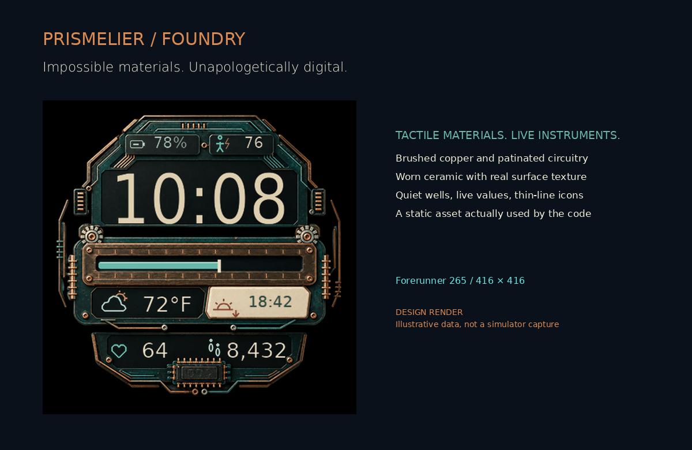
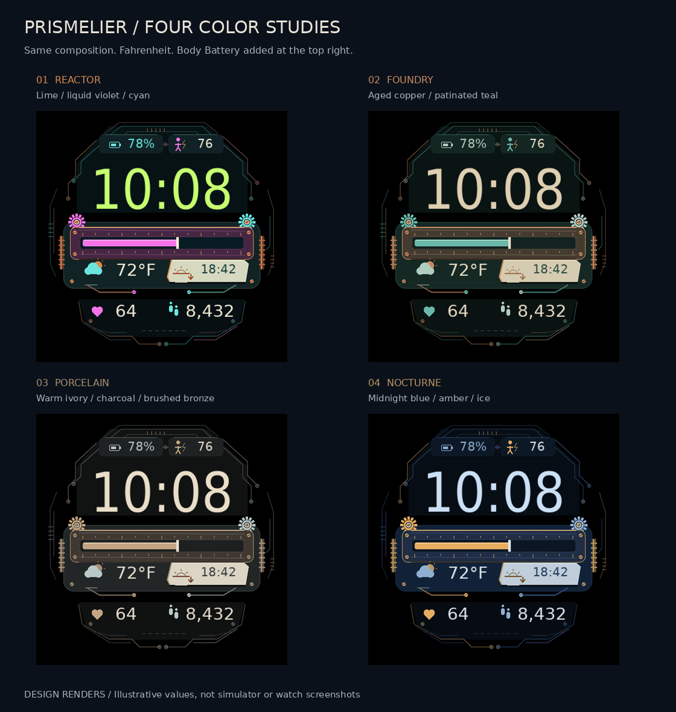

# Prismelier

**Impossible materials. An everyday time machine.**

A bespoke, futuristic-steampunk digital watch face for the **Garmin Forerunner 265**. The default **Foundry** theme pairs warm ivory numerals with a patinated-teal Fahrenheit bar and **hyperreal material textures from a real 416px bitmap resource**. Aged copper, petrol enamel and an asymmetric ceramic solar insert sit on a meticulously routed robotics backplane: pin headers, copper flex traces, actuator housings and a miniature processor package. The face contains no branding, date, word labels or outer clock indices.



> **Source implementation, not yet an installable release.** The design images are generated layout previews with fictional data, not Garmin simulator or hardware screenshots. The official Garmin 9.2.0 parser accepts the source. A real FR265 compile is still blocked by missing official device profiles in the build environment; simulator and physical-watch testing have not run. No `.prg` is supplied or claimed to work. See [QA status](docs/QA.md).

## On the face

- **Digital time**, following the watch's 12/24-hour preference by default
- **Linear Fahrenheit temperature bar** with a precise numeric reading
- **Weather icons**, beside the temperature and the next sun event, with clear stale/missing states
- **Device battery percentage** and a battery icon
- **Body Battery score** (0–100) beside a distinct person/energy-bolt icon
- **Next sunrise or sunset**, automatically switching to the next event, with distinct rising/sinking sun and up/down-arrow icons
- **Recent heart rate** in BPM and the exact daily step count
- Brushed copper, worn ceramic and textured circuit-board surfaces, with exposed gearwork, fasteners, inlaid traces and actuator housings
- Consistent thin-line weather, sunrise/sunset and metric pictograms drawn live over the texture
- Sparse, dim, moving digital-time-only **always-on display**

No clock hands or analog perimeter. The temperature is a **bar**, not a round dial. On-face text is limited to essential numbers, units and AM/PM when needed.

**Device:** 416 × 416 AMOLED Forerunner 265 (`fr265`). The smaller 265S and other models are intentionally not declared compatible.

## Load it onto your watch

Start with the [step-by-step build and USB installation guide](docs/INSTALL.md). The short version:

1. Install Garmin's official Connect IQ SDK Manager and Monkey C extension; use SDK Manager to install the SDK **and the Forerunner 265 device profile**
2. Open this folder in VS Code and use **Monkey C: Build for Device → Forerunner 265**
3. Copy the resulting `.prg` to the watch's `GARMIN/APPS` folder over a data-capable USB cable
4. Disconnect safely, then hold **UP → Watch Face**, select **Prismelier**, and apply

An iPhone can keep Garmin weather in sync, but the Connect IQ phone app does not import this raw development `.prg`. The initial sideload needs a computer. There is no Garmin Store listing.

## Data honesty

The face does not contain demo readings. Preview values exist only in `tools/render_preview.py`.

| Complication | Source and limits |
|---|---|
| Temperature/weather | `Weather.getCurrentConditions()`, which reads Garmin's existing cache; it cannot force a new observation |
| Weather older than 2h | Reading retained; bar muted, weather icon copper and crossed out, crossed-ring warning beside temperature |
| Weather 24h old, timestamp missing, or future timestamp | Empty bar, `--°F`, crossed-out weather icon; no invented reading |
| Heart rate | Most recent valid `SensorHistory` measurement, no older than 120 seconds; a recent reading, not a continuously activated sensor |
| Steps | Watch's daily activity-monitor count; missing data is `--`, while a genuine zero remains `0` |
| Device battery | Watch's percentage, truncated to its integer portion |
| Body Battery | Latest local timestamped `SensorHistory.getBodyBatteryHistory()` score, 0–100; missing, future or more-than-15-minute-old samples show `--` |
| Solar event | Garmin's sunrise/sunset calculation at the weather observation location, in the watch's local time; location may differ from your present position |

A small copper ring at the solar insert's lower right means the weather-derived location is at least two hours old. Solar location expires after 24h. When there is no location or no event available in today's/tomorrow's window (including polar conditions), the insert shows a muted horizon icon and `--:--`. An upward arrow and lifted sun means sunrise; a downward arrow and sinking sun means sunset. These age thresholds are this project's policy, not a Garmin update guarantee.

In 12-hour mode, the time has **AM/PM** and a solar time uses **A/P** (for example, `6:42P`). The Fahrenheit bar spans 0–120°F (the optional Celsius setting uses −20–40°C). Its piston clamps at the endpoints; the number still shows the actual reported temperature outside that range.

## Preferences

Temperature defaults explicitly to **Fahrenheit**, regardless of the watch's unit setting. Time format follows the watch. Project properties also support optional Celsius/device units, explicit 12/24-hour format and four complete material/color palettes. **Foundry (`Palette = 1`) is the default.** [Settings instructions](docs/INSTALL.md#preferences) include the reliable source/simulator path for sideloaded builds. Phone settings for unpublished sideloaded apps are not guaranteed.

## Four color studies



- **0 · Reactor**: the vivid original, lime / liquid violet / cyan
- **1 · Foundry (default)**: aged copper, warm timber and patinated teal
- **2 · Porcelain**: warm ivory, charcoal and brushed bronze
- **3 · Nocturne**: midnight blue, amber and ice

These preserved color studies show the shared composition with Body Battery before the final robotics-detail pass. The latest Foundry hero above shows the added connectors, actuator housings, processor package and final hyperreal material pass with monoline icons. Select `Palette` in the project settings; see the [sideload settings notes](docs/INSTALL.md#preferences). Theme colors come from `resources/themes.json`, compiled into `source/PrismelierPalette.mc` by `tools/generate_palettes.py`, and used by the design renderer too. This keeps the color definitions consistent with the source; the earlier study images are retained to document the design choice. Foundry uses the actual bitmap resource; the other palettes keep procedural materials. The ambient time stays the same sparse, dim gray across themes. `python tools/render_preview.py --refresh-studies` regenerates the full study sheet against the newest geometry when explicitly desired.

The **left top capsule** is device charge (`%`). The **right top capsule**, with the person/energy bolt, is Body Battery (a score, without `%`). It is a wellness estimate, not a medical measurement. [Official API and supported devices](https://developer.garmin.com/connect-iq/api-docs/Toybox/SensorHistory.html#getBodyBatteryHistory-instance_function).

## Privacy and power

- No API key, account, subscription, backend, advertisements or network permission
- No GPS activation, external health-data transmission or persistent location storage
- `SensorHistory` reads recent HR and Body Battery; `Positioning` permits access to the existing weather observation position
- Data cached in RAM, expensive reads once per minute; no timers or seconds animation
- One opaque native-resolution Foundry background reference, no full-screen buffer copies
- Full color/materials on wake; the texture is never drawn in AOD, which uses dim digital time in three separate positions
- This is a personal glance display, not a medical instrument or a source for safety-critical weather/navigation

## Development

```sh
python -m unittest discover -s tests -v
python tools/build.py --sdk /path/to/connectiq-sdk --key /private/path/developer.der --release
```

Committed BMFont atlases make builds independent of system fonts or Python. Optional preview/font regeneration uses Python + Pillow and locally installed DejaVu fonts:

```sh
python tools/generate_palettes.py
python tools/generate_fonts.py --font-dir /usr/share/fonts/truetype/dejavu
python tools/render_preview.py
```

Several actual-size visual refinements and an independent design critique informed the material treatment, sunrise/set iconography and worst-case spacing. See [QA](docs/QA.md) for what has actually been tested and the outstanding device checks. Font licensing is included in `resources/fonts/LICENSE-DejaVu.txt`. The Foundry background is an AI-generated project asset; live icons and alternate material palettes are code-drawn. See [texture provenance and memory budget](docs/TEXTURE.md). No watch-brand artwork or logos are included. Garmin, Forerunner and Connect IQ are trademarks of Garmin; this is an independent project, not endorsed by Garmin.
