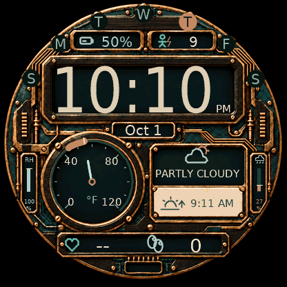
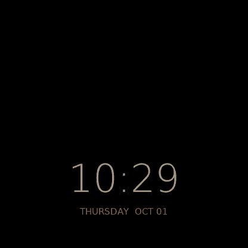

# Prismelier

A copper-and-wood watch face with time, weather, sunrise/sunset, Body Battery, heart rate, and steps.

## Features

| Feature | What you see |
|---|---|
| Time | Large digital clock with 12/24-hour formats and an AM/PM indicator in 12-hour mode |
| Calendar | Sunday-first weekday rim with today highlighted, plus the local month and day |
| Temperature | Current-temperature needle on a °F or °C dial, with an overflow marker for readings beyond the scale |
| Daily temperature range | Copper arc showing today's forecast low–high range, with markers when the range extends beyond the dial |
| Weather conditions | Condition icon and label for clear, cloudy, rain, storm, snow/ice, wind, fog, and other conditions; clear skies use a moon icon when sunrise is next |
| Humidity | Relative humidity percentage and a vertical gauge on the left |
| Rain chance | Today's forecast precipitation percentage and a matching vertical gauge on the right |
| Sunrise & sunset | Next sunrise or sunset time in the selected time format, with a distinct rise/set icon and an indicator when the weather-derived location is old |
| Watch battery | Charge percentage and battery-fill icon; the percentage changes color at 15% or below |
| Body Battery | Separate 0–100 energy score using Garmin's current value, with recent history as a fallback |
| Heart rate | Current available heart rate, refreshed while awake, with recent history as a fallback |
| Steps | Daily step count with thousands separators and text that scales to fit larger totals |
| Data availability | Missing readings show placeholders; aged weather is flagged, expired weather is hidden, and the forecast range and rain chance are hidden when weather is stale |
| Always-on | Large warm-colored time with a copper weekday/date line on black; shifts position each minute |
| Themes | Foundry (aged copper and teal), Reactor (lime, violet, cyan, and copper), Porcelain (warm ivory and charcoal), and Nocturne (midnight blue and amber) |
| Preferences | Choose a theme, follow the watch's time and temperature settings, or override with 12/24-hour time and °F/°C |

## Download

Choose your **exact watch model**. The 265 and 265S use different files.

| Watch | Download |
|---|---|
| Forerunner 265 | [Download .prg](https://github.com/bensonlee5/prismelier/raw/refs/heads/main/dist/models/fr265/Prismelier-fr265.prg) |
| Forerunner 265S | [Download .prg](https://github.com/bensonlee5/prismelier/raw/refs/heads/main/dist/models/fr265s/Prismelier-fr265s.prg) |
| Forerunner 165 | [Download .prg](https://github.com/bensonlee5/prismelier/raw/refs/heads/main/dist/models/fr165/Prismelier-fr165.prg) |
| Forerunner 165 Music | [Download .prg](https://github.com/bensonlee5/prismelier/raw/refs/heads/main/dist/models/fr165m/Prismelier-fr165m.prg) |
| Forerunner 965 | [Download .prg](https://github.com/bensonlee5/prismelier/raw/refs/heads/main/dist/models/fr965/Prismelier-fr965.prg) |
| Forerunner 970 | [Download .prg](https://github.com/bensonlee5/prismelier/raw/refs/heads/main/dist/models/fr970/Prismelier-fr970.prg) |
| Venu 2 | [Download .prg](https://github.com/bensonlee5/prismelier/raw/refs/heads/main/dist/models/venu2/Prismelier-venu2.prg) |
| Venu 2 Plus | [Download .prg](https://github.com/bensonlee5/prismelier/raw/refs/heads/main/dist/models/venu2plus/Prismelier-venu2plus.prg) |
| Venu 3 | [Download .prg](https://github.com/bensonlee5/prismelier/raw/refs/heads/main/dist/models/venu3/Prismelier-venu3.prg) |
| Venu 3S | [Download .prg](https://github.com/bensonlee5/prismelier/raw/refs/heads/main/dist/models/venu3s/Prismelier-venu3s.prg) |
| epix (Gen 2) | [Download .prg](https://github.com/bensonlee5/prismelier/raw/refs/heads/main/dist/models/epix2/Prismelier-epix2.prg) |
| epix Pro (Gen 2) 47mm | [Download .prg](https://github.com/bensonlee5/prismelier/raw/refs/heads/main/dist/models/epix2pro47mm/Prismelier-epix2pro47mm.prg) |
| fēnix 8 43mm | [Download .prg](https://github.com/bensonlee5/prismelier/raw/refs/heads/main/dist/models/fenix843mm/Prismelier-fenix843mm.prg) |
| fēnix 8 47mm / 51mm | [Download .prg](https://github.com/bensonlee5/prismelier/raw/refs/heads/main/dist/models/fenix847mm/Prismelier-fenix847mm.prg) |

Forerunner 265 has been checked in Garmin’s simulator. Other models are experimental and have not been visually tested on their watches.

## Install

1. Download your model’s `.prg` file above.
2. Connect the watch to your computer by USB and copy the file into its existing `GARMIN/APPS` folder. On macOS, use an MTP file-transfer app if the watch does not appear in Finder.
3. Disconnect the watch. Hold **UP/MENU → Watch Face**, choose **Prismelier**, and apply it (menus vary by model).

No SDK is needed. The phone’s Connect IQ app cannot install these files. [Detailed USB instructions](docs/INSTALL.md#4-copy-the-prg-over-usb).

The default is Foundry with Fahrenheit and your watch’s time format. [Change preferences](docs/INSTALL.md#preferences). Weather requires a recent Garmin Connect sync; missing readings appear as `--`.

Enable **Always On Display** in your watch’s display settings for the low-light view.
