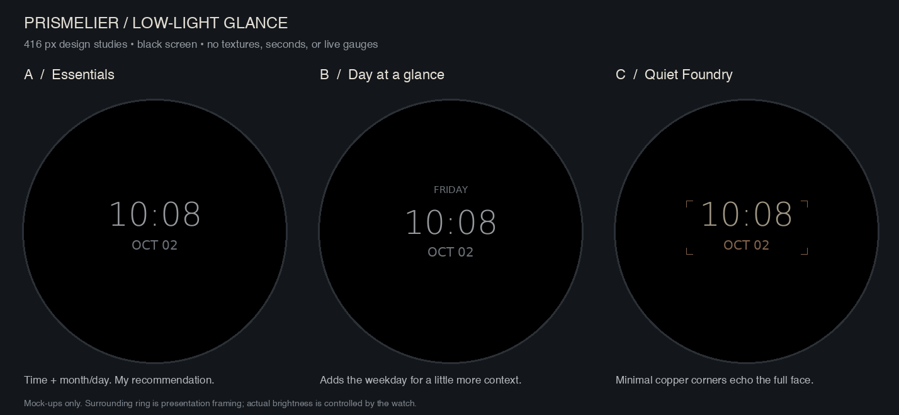

# Low-light glance concepts

These are design mock-ups, not simulator captures or changes installed on the watch.

- **A — Essentials (recommended):** time and month/day.
- **B — Day at a glance:** adds the weekday above the time.
- **C — Quiet Foundry:** time and month/day with sparse copper corners.

## Proposed behavior

Extend the existing sleep-mode view. Use a black background and the shipped thin Ambient time font; show the date with Small and the optional weekday with Label. Follow the user's 12/24-hour preference, refresh the local date directly each minute, and omit seconds and sensor readings. Repaint the complete low-power frame on each callback, and return to the full face on wake. Always-on must be enabled in the watch settings.

Move the whole group between separated safe positions, retaining burn-in protection rather than pinning the date in place. Verify every time/date combination and each display size with Garmin's heat-map tool before shipping. The sample renderings use approximately 1.3–1.5% of the circular display's pixels; these are illustrative static estimates, not a worst-case or firmware validation.

Garmin's [AMOLED guidance](https://forums.garmin.com/developer/connect-iq/b/news-announcements/posts/changes-to-watch-face-low--and-high-power-modes) specifies one update per minute and a 10% lit-pixel limit. Preview colors do not predict physical brightness or battery drain.

Regenerate with `python3 tools/render_ambient_concepts.py` using the existing bitmap font assets. The gray watch outline belongs to the comparison presentation and is not part of the proposed screen.
